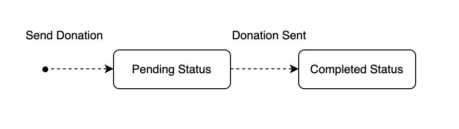
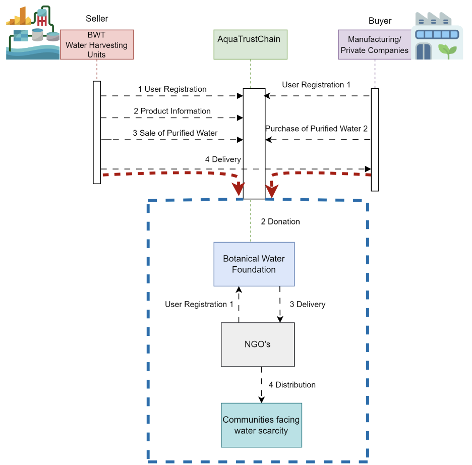
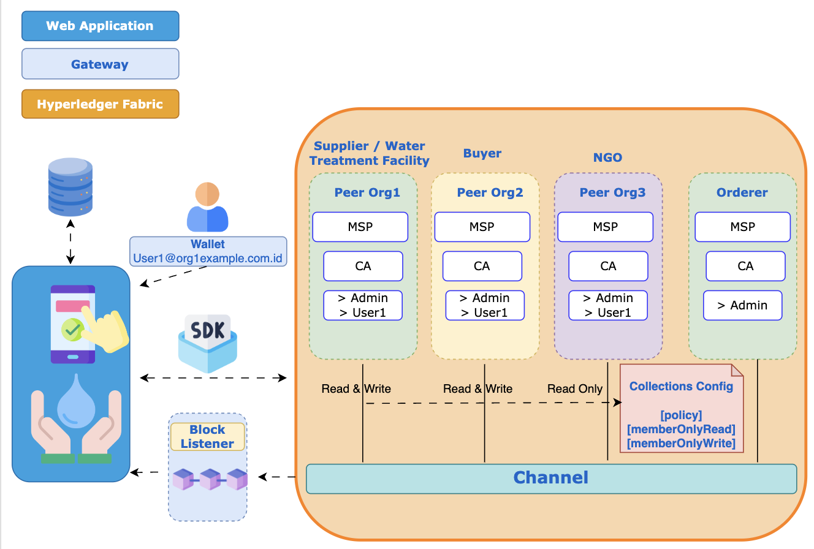

##### AquaTrustChain #####
The project focuses on the bulk donation of water across NGO that will be then distributed to the world’s most vulnerable people. AquaTrustChain aims to distribute high-quality water efficiently and ensure transparency and trust in the donation process, reducing the risk of scams and ensuring communities across different regions have access to high quality water.


##### Team #####
```
1. Ciel Recuerdo: Architect, Blockchain Developer, Web App Backend Developer, Project Manager

2. John Vincent Escalante: Business Analyst 

3. Om Chevli: Front End Developer

4. Harold Felipe: Web App Backend Developer
```

##### Requirements #####
1. Three organizations will be registered in the system: Org1 as the Supplier or Water Treatment Facility, Org2 as the Buyer and Org3 as the NGO.

2. Use Private Data Collections to manage sensitive information while maintaining privacy and confidentiality among different organizations involved.
> Participants:
Org1MSP and Org2MSP: Can execute water donation transactions. Has both read and write access.

Org3MSP: Acts as an observer with read-only access to some transaction details.

3. Registration details of donors and recipients are stored on the web application database.

4. Donations are pushed in the blockchain.

5. Add a block listener to listen to block events as confirmation of transaction and block creation.

6. Gateway will require connection profile and identities stored in the wallet.

7. Front-end to be integrated with the gateway or API to communicate with Smart Contracts and separately integration with the web application.
 

##### State Diagram #####


##### Sequence Diagram #####


##### Architecture #####


##### Roles and Policies #####
> Peer Nodes: Org1, Org2, Org3
- Admin and Peer

> Orderer: Owned by Org1 (Project Initiator)
- Admin

> Read and Write Access: Org1, Org2 
> Read-only Access: Org3


##### Project Setup #####
Check README files on all the folders. Setup in the following order:
1. Chaincode
2. Application Gateway
3. Web Application Backend
4. Frontend


##### Snapshots of Application Results #####


