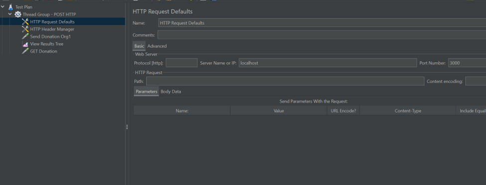
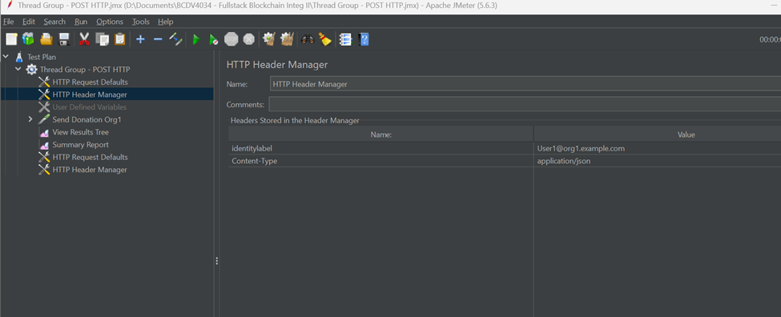
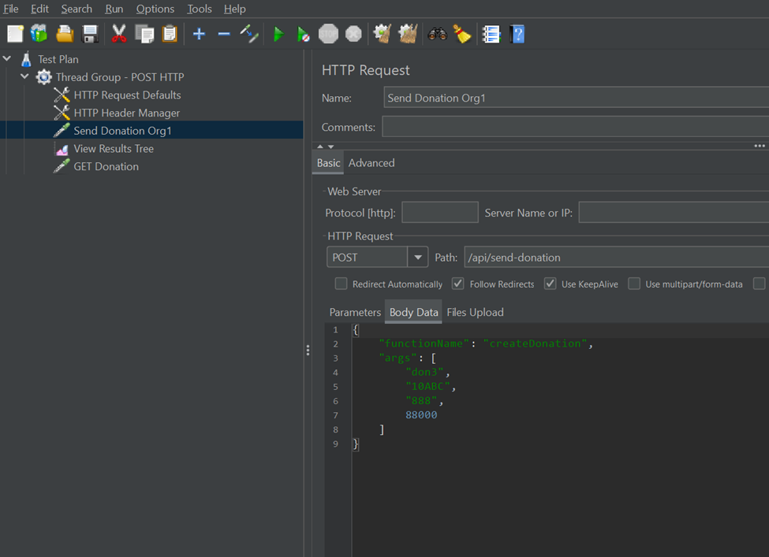
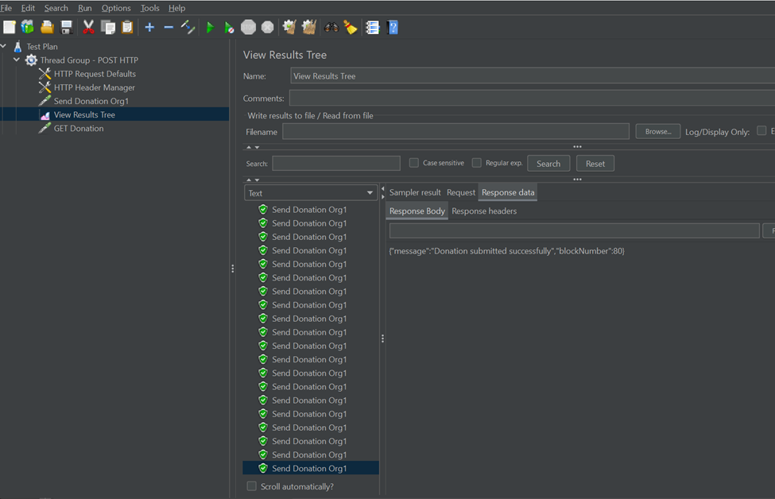
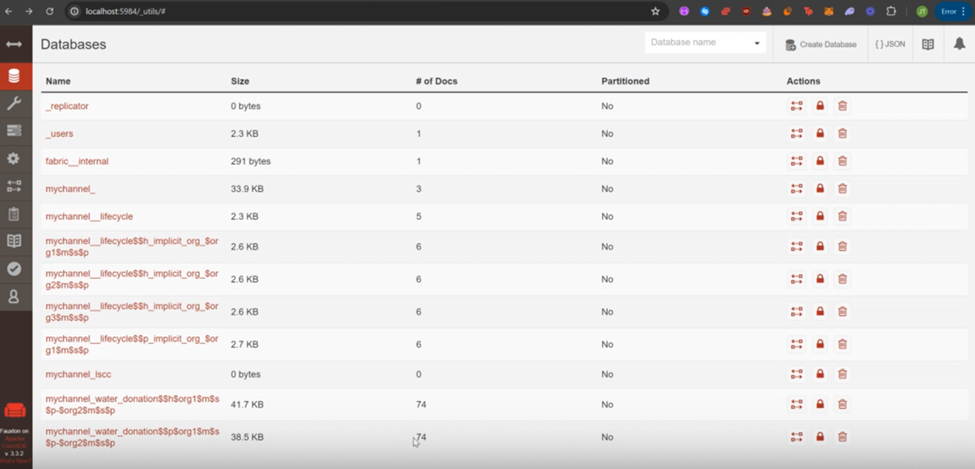
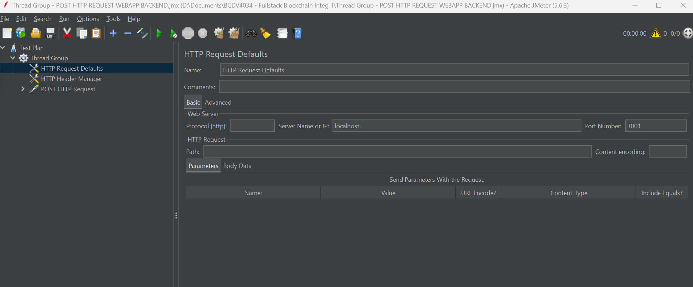
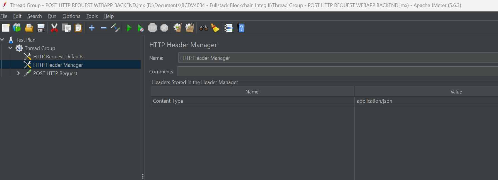
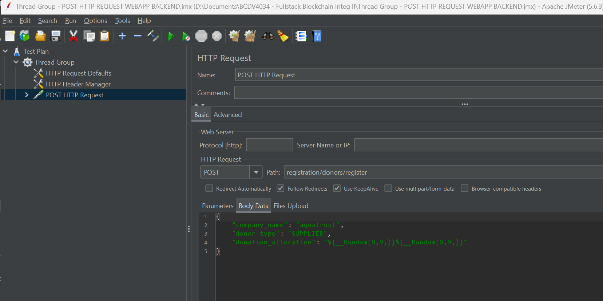
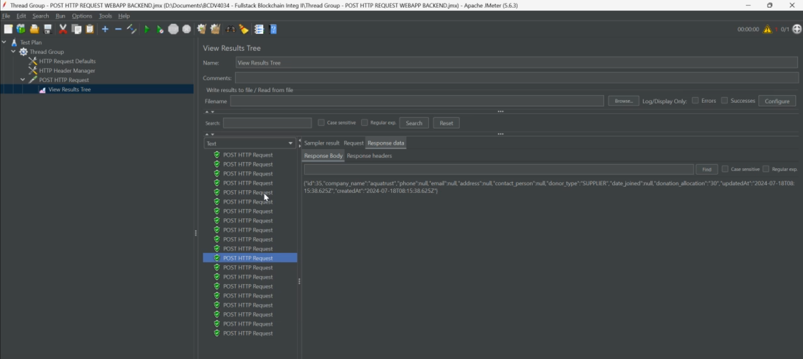

# Include Screenshots for Test Reults for API Gateway and Backend

# Steps in Creation for POST Request sending multiple donations from Org1 API GATEWAY:
> Add HTTP Request Defaults from thread group
> Server name or IP: localhost
> Port number: 3000

> Add HTTP Header Manager

> Add HTTP Post Request Config for Sending donations:

# Sending Donations Successful from Org1 

# Couch DB Gets updated

# Video Recording API GATEWAY POST REQUEST:
https://www.loom.com/share/ad676913c4e24a92b25e8b4916bc3547 

# Steps in Creation for POST Request registration of donors from Org1 WEB APP BACKEND:
> HTTP Request Default

> HTTP Header Manager

> POST HTTP Request

# Registration for Donor Successful from Org1 

# Link for Video Recording WEB APP BACKEND POST REQUEST:
https://www.loom.com/share/e539a1e43adc4dc3b5e8be4f7ffd705a

